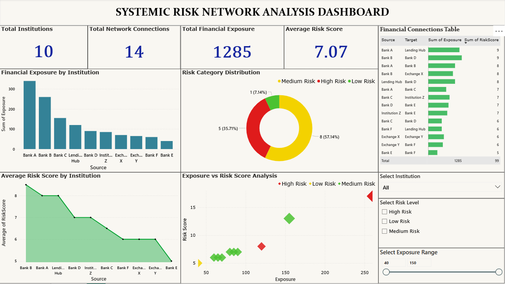

# Systemic Risk Network Analysis Dashboard

OVERVIEW 

This project presents an interactive Systemic Risk Network Analysis Dashboard built using Microsoft Power BI. The dashboard analyzes financial exposure between institutions and helps identify potential systemic risks within a financial network.

TOOLS USED

- Microsoft Power BI
- Microsoft Excel
- DAX (Data Analysis Expressions)

KEY FEATURES 

- Overview KPIs: Total Institutions, Network Connections, Total Exposure, and Average Risk Score
- Financial Exposure by Institution
- Risk Category Distribution (Low, Medium, High Risk)
- Average Risk Score by Institution
- Exposure vs Risk Analysis
- Interactive filters for Risk Level, Exposure Range, and Institution

PURPOSE 

The dashboard helps visualize relationships between financial institutions and identify high-risk connections that may contribute to systemic financial instability.
 

## Dashboard Preview

